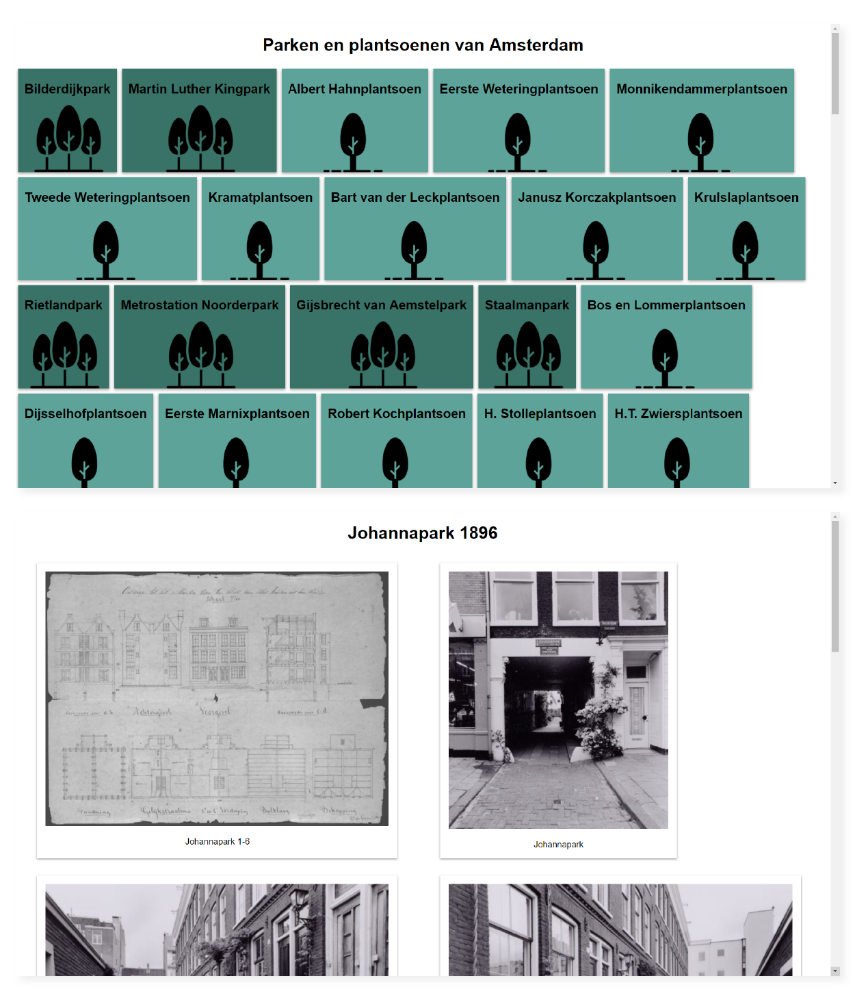
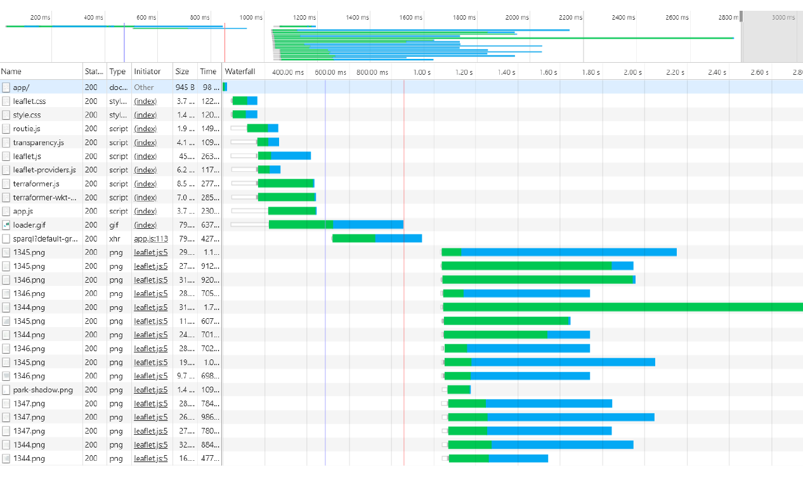
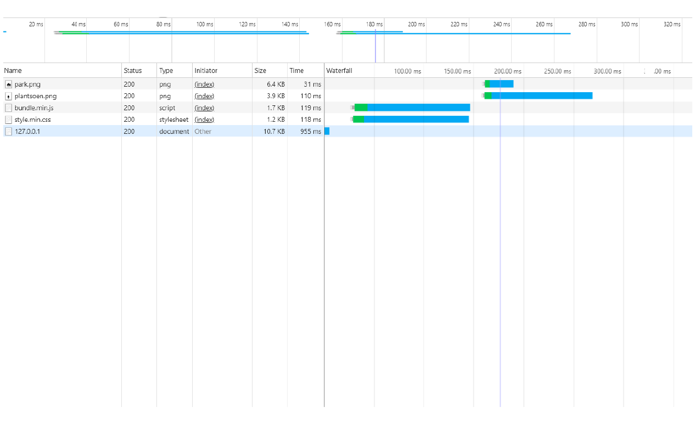
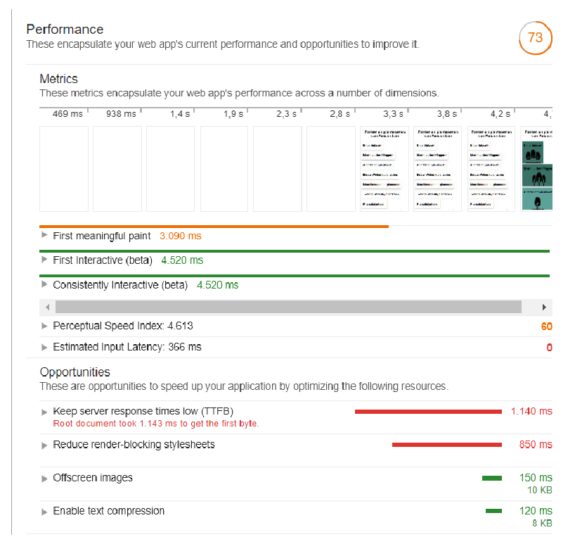
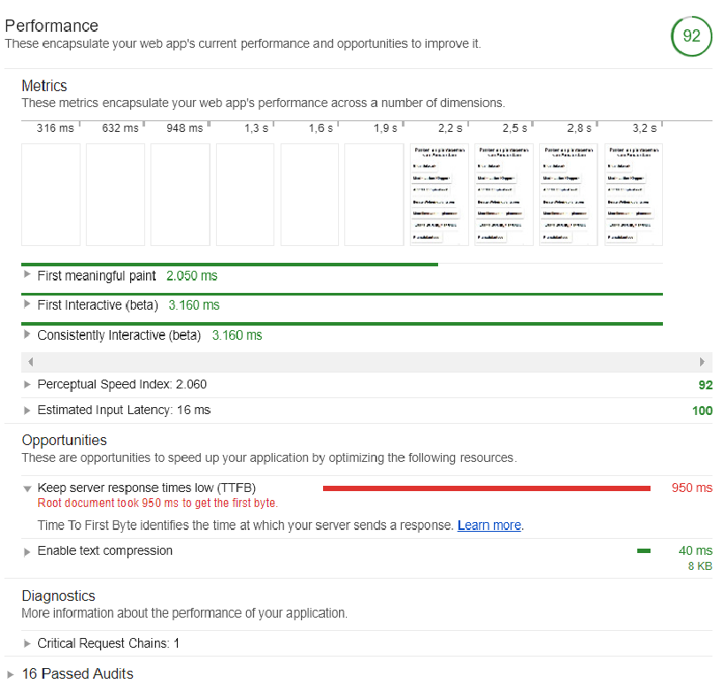
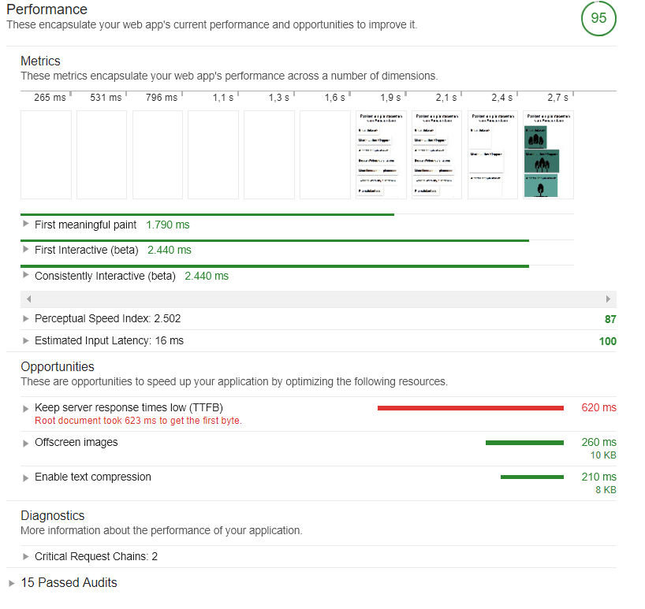

# performance-matters-server-side

A server-side application. The app is changed to its bare minimum. You can only show a list of all Parks. The full version you can view here:  [Parks of Amsterdam](https://velomovies.github.io/Project-1-WEBDEV/app/#home). The new version you can download with the instructions below. 


> A sneak peak

## Background

I removed all javascript in this version and tried to enhance it. The app itself was already fast with the first paint, but didn't work without javascript. The app I made works server-side. I started a node server and made sure it would work without javascript. Next to that I made a few enhancements for the performancy. 

I mostly checked the performance with the [lighthouse/audit tool in chrome](https://developers.google.com/web/tools/lighthouse/). That way I could see the diffence made by a few code changes. Below you can find most of the changes and the audit I did.

I made sure the app works without javascript, but it also works with javascript. I added some client-side javascript that could make the app a little more fun to use. For example I checked client-side what the different parks there where and added different styles to them. 

Next to that I added a check. If you are offline than a message will pop-up and will tell you that the page is offline. I checked that with:
```javascript
if(!document.querySelector('.offline-page')) {
  if(!navigator.onLine) {
    // Run your code...
  }
}
``` 

## Enhancement  

The enhancements I did exsisted out of a few things. Below you can see the results I had with screenshots of the audits I did

With browserify I tried to make an even better and faster javascript file. With the code used below the javascript is bundled automatically. Browserify uses all requires in the main js and bundles them in one file. running `npm run start` starts bundeling the code
```json
{
  "browserify": "browserify sources/js/main.js -o sources/js/bundle.js",
} 
```
I used `compression` (a npm package) to compress the page. That way it made the page much faster in loading.
```javascript
app.use(compression());
```

When loading a page I made sure there is critical css. When the page is loaded the rest of the css will show up. I used some javascript to check when the page was loaded. When there is no javascript it will just load the stylesheet normally.
```HTML
<link rel="preload" href="/css/style.min.css" as="style" onload="this.onload=null;this.rel='stylesheet'">
<noscript>
  <link rel="stylesheet" href="/css/style.min.css">
</noscript>
```

As progressive web app I added a `manifest.json`. That will help the user if it wants to install the app on there phone. With installing it as an app it will be available offline. Next to that it is much 'appier'

I added a [service worker](https://developer.mozilla.org/en-US/docs/Web/API/Service_Worker_API). I could specify when and what the service worker will put in the cache. The cache is filled with the pages the user has seen. When the user is offline it will show the user the cached page. When the page isn't cached yet it will send you to the `offline` page. This pages shows a message to the user that the user is offline.
Next to the page it will show a message that the page may be not up to date because the user is offline. When the user is back online it will update all pages and show the right data. 

On first load it caches the core functions and the main page. When there the user loads a new page, that page will also be put in the cache.
```javascript
caches.open('bs-v1-core')
      .then(cache => cache.addAll([
        '/views/offline/',
        '/css/style.min.css',
        '/js/bundle.min.js'
    ])),

caches.open('bs-v1-pages')
      .then(cache => cache.add('/'))
      .then(self.skipWaiting())
```

## Audits

The difference between the old app and my enhanced version.

### Network audits

> **Old app**


> **Enhanced app**



### Performance audits

The first time I did an audit these where the numbers of the performance. I did all enhancements above and it showed a great performance boost. 

> **First audit**


> **Audit after compression and minifying**


> **Last audit (With checking the stylesheet)**


The app really upgraded in performance. The service worker was hard to work with for testing, but in the end it was great to use. Especially in the case that the user has no internet.

## TO DO

The thing I would like to do in the future is showing the map again. I could do that client-side, but there is also a way to render everything server-side. If I would have more time (or money) I would invest in looking in to a way to do that.

Next to the map I would have liked to make sure my app was a little bit more designed. I would like to add some more styling so it looks more attractive. For performance thats not a great thing, but there are a lot of ways to go around that problem.

## Set up
**1. Clone repository:**
```
git clone https://github.com/velomovies/performance-matters-server-side.git
```
**2. Install dependencies:**
```json
{
"dependencies": {
    "browserify": "^16.1.1",
    "compression": "^1.7.2",
    "express": "^4.16.3",
    "nunjucks": "^3.1.2",
    "request": "^2.85.0"
  }
} 
```

To install all you do:
```
npm install
```

**3. Build and start server:**
```
npm start
```

To browsify the code do. Browsify will collect all modules in one page. 
```
npm start 
```
or 
```
npm run browsify
```

**4. Open the app**

Open [127.0.0.1:8000](127.0.0.1:8000) in your browser to see the app

## License
GPL-3.0 © Victor Zumpolle